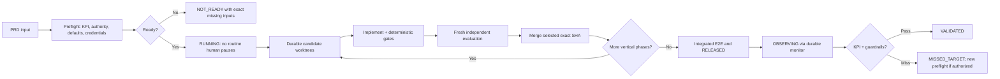

# Product Loop

[Documentation](https://sudosapient.github.io/product-loop/) · [npm](https://www.npmjs.com/package/@sudosapient/product-loop) · [Security](SECURITY.md)

`product-loop` is a reusable agent skill for taking a PRD through measurable specification, UX, implementation, independent verification, worktree candidate selection, exact-SHA integration, release, and KPI observation.

It is also a portable Pi package and CLI. On a new machine, install it and provide only the LLM proxy URL and API key:

```sh
npm install -g @sudosapient/product-loop
product-loop setup
```

When installing from a source checkout instead:

```sh
./scripts/install.sh
```

Then create and run a project:

```sh
mkdir my-product && cd my-product
product-loop init
$EDITOR PRD.md
git add PRD.md && git commit -m "Define product"
product-loop start
```

Monitor it in another terminal with `product-loop dashboard`, `product-loop status --watch`, or `product-loop logs`. The public documentation is hosted on GitHub Pages; private project state, logs, and the live model refresh remain available only through the localhost dashboard.

The live model catalog is capability-aware. Product kickoff refreshes the proxy, sends only text models to Pi, and keeps image/video generators available to the product workflow:

```sh
product-loop models
product-loop media image --prompt "Wide editorial hero image; no text or logos" --size 1536x1024
product-loop media video --prompt "Eight-second seamless product background loop" --duration 8
```

Generated assets are not accepted in isolation: the loop evaluates them inside the real responsive UI for crop, contrast, accessibility fallback, performance, provenance, and visual quality.

It supports two execution modes:

- `supervised`: pause at material product, UX, authority, and release decisions;
- `autonomous`: finish all discovery and decision setup in preflight, then run without routine human intervention after the durable `RUNNING` marker.

Autonomous mode does not invent credentials, permissions, consent, budget, or product policy. If those cannot be resolved before kickoff, the run is `NOT_READY`. After kickoff it continues through retries, changed approaches, model escalation, councils, rollback, and durable resume; it may end `BLOCKED` only when safe in-contract alternatives or the frozen global budget are exhausted. `RELEASED` is a delivery milestone; the run remains `OBSERVING` until KPI evidence yields `VALIDATED` or `MISSED_TARGET`.

## Minimal Pi setup

Requirements:

```sh
pi --version
pi --list-models llm-proxy
pi list
```

Install `pi-subagents` only when it is absent:

```sh
pi install npm:pi-subagents
```

For a reviewed/trusted target repository, optionally copy the role defaults. Install the decisive evaluator at reviewed user scope because secure/gating calls use `agentScope: "user"`:

```sh
set -eu
PI_SKILL=/absolute/path/to/product-loop
mkdir -p .pi
cp "$PI_SKILL/assets/pi/settings.json" .pi/settings.json
mkdir -p ~/.pi/agent/agents
user_evaluator=~/.pi/agent/agents/blind-evaluator.md
if [ -e "$user_evaluator" ]; then
  cmp -s "$PI_SKILL/assets/pi/agents/blind-evaluator.md" "$user_evaluator"
else
  install -m 0600 "$PI_SKILL/assets/pi/agents/blind-evaluator.md" "$user_evaluator"
fi
```

Then launch the parent:

```sh
PI_SKILL=/absolute/path/to/product-loop
PRD=/absolute/path/to/prd.md

pi \
  --model llm-proxy/gpt-5.6-sol \
  --thinking high \
  --name product-loop \
  --skill "$PI_SKILL" \
  --approve \
  @"$PRD" \
  @"$PI_SKILL/assets/pi/autonomous-run-prompt.md"
```

`--approve` trusts project-local Pi settings/extensions/agents. Inspect them first. It is an input-loading decision, not a sandbox. For untrusted unattended code, use OS/container isolation with minimum mounts, network, and credentials; start the parent in a separate reviewed orchestration directory; pass the target only as each task's `cwd`; set top-level `agentScope: "user"` plus per-task `skill: false`; reject agents with unexpected MCP tools, skills, memory, or extensions; and avoid slash routes. Never execute Pi-generated resume snippets verbatim because they may omit the required user-only scope. Add `--no-approve --no-context-files` and the supplied child wrapper only as defense-in-depth. The mandatory details are in [Pi trust and dispatch](product-loop/references/pi-orchestration.md#4-configure-project-defaults).

## Model route

| Role | Exact Pi model |
|---|---|
| Parent, hard synthesis, UI computer-use E2E | `llm-proxy/gpt-5.6-sol` |
| Default implementation worker / cheap candidate | `llm-proxy/grok-4.5` |
| Fresh independent reviewer / architecture escalation | `llm-proxy/claude-opus-4-8` |

The direct commands below start separate top-level Pi sessions:

```sh
pi --model llm-proxy/gpt-5.6-sol
pi --model llm-proxy/grok-4.5
pi --model llm-proxy/claude-opus-4-8
```

For a reviewed trusted project, the slash shortcuts can create tracked children:

```text
/run worker[model=llm-proxy/grok-4.5] "Implement the frozen phase contract in your assigned worktree." --bg
/run reviewer[model=llm-proxy/claude-opus-4-8] "Independently verify the immutable candidate SHA. Do not edit." --bg
```

Do not use those slash routes for untrusted targets: `pi-subagents` 0.34.0 hardcodes their discovery scope to `both`. Autonomous/secure orchestration calls the tool directly, keeps discovery at the reviewed parent cwd, and sets only per-task target paths:

```typescript
subagent({
  tasks: [{
    agent: "worker",
    model: "llm-proxy/grok-4.5",
    cwd: "/absolute/isolated-candidate-worktree",
    skill: false,
    task: "Implement the frozen phase contract, verify it, commit it, and return the full SHA. Do not launch subagents."
  }],
  concurrency: 1,
  agentScope: "user",
  context: "fresh",
  async: true,
  timeoutMs: 1800000
})
```

For autonomous/headless use, the parent records each async run ID, keeps doing independent work, then calls Pi's `wait()` tool before the turn ends. This preserves parallelism without abandoning children.

## Delivery shape



Pi-native `worktree: true` is temporary and its artifact capture/cleanup are best-effort. The production loop instead pre-creates durable worktrees, gives each writer one absolute `cwd`, requires a clean commit/full SHA, verifies each SHA in a detached worktree, uses a fresh exact-SHA reviewer for one candidate or sanitized blind comparison for competing candidates, and merges the selected immutable SHA through one integration checkout.

## Main references

- [`product-loop/SKILL.md`](product-loop/SKILL.md) — orchestrator contract
- [`product-loop/references/protocol.md`](product-loop/references/protocol.md) — states, gates, councils, retries, completion
- [`product-loop/references/pi-orchestration.md`](product-loop/references/pi-orchestration.md) — exact Pi commands, subagents, headless mode, recovery
- [`product-loop/references/worktrees.md`](product-loop/references/worktrees.md) — durable worktree creation, evaluation, exact-SHA merge, cleanup
- [`product-loop/references/model-routing.md`](product-loop/references/model-routing.md) — quality-first model routing and escalation
- [`product-loop/references/observation.md`](product-loop/references/observation.md) — product-specific KPI monitor contract, durable scheduler, and scheduled resume
