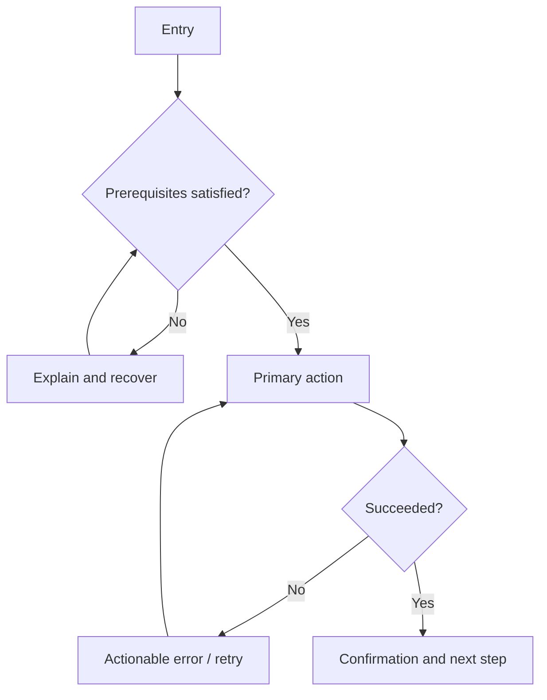

# UX flow and mockups

## 1. Journey

- Persona/context:
- Entry point:
- User goal:
- Success moment:
- Exit/recovery:

## 2. Flow

Replace this example with the approved flow, including alternate and failure paths.

## 3. Screen/state inventory

| ID | State/screen | User intent | Primary action | Required content/data | Acceptance IDs |
|---|---|---|---|---|---|
| UX-1 |  |  |  |  |  |

Cover loading, empty, first-use, invalid, permission, offline/degraded, partial success, success, and destructive confirmation where applicable.

## 4. Mockups

| Screen/state ID | Artifact link/path | Viewport/theme | Version | Approval |
|---|---|---|---|---|
| UX-1 |  |  |  |  |

## 5. Copy and interaction contract

- Labels and calls to action:
- Validation and error messages:
- Confirmation/recovery copy:
- Keyboard/focus behavior:
- Motion and reduced-motion behavior:

## 6. Responsive and accessibility contract

| Concern | Required behavior | Verification |
|---|---|---|
| Keyboard/focus |  |  |
| Screen reader/semantics |  |  |
| Contrast/color independence |  |  |
| Touch targets |  |  |
| Small/medium/large viewport |  |  |
| Text zoom/overflow/localization |  |  |

## 7. Media and asset plan

Use `product-loop models` immediately before approving this plan. Read `references/media-generation.md` when generation is required.

| Asset ID | Product purpose / screen | Source: existing, CSS, screenshot, generated | Required capability / live model candidates | Aspect + responsive crops | Alt text / reduced-motion fallback | Weight target | Evaluator + evidence path |
|---|---|---|---|---|---|---|---|
| MEDIA-1 |  |  |  |  |  |  |  |

- Visual direction and subject constraints:
- Forbidden content, logos, embedded text, or misleading claims:
- Candidate count and generation budget:
- Provenance/receipt location and replacement path:

## Approval gate

- [ ] Happy, empty, loading, error, permission, and recovery paths are explicit.
- [ ] Copy, responsive behavior, and accessibility are testable.
- [ ] Mockups map to state IDs and PRD acceptance IDs.
- [ ] Material subjective choices have the named evaluator/rubric required by the execution contract.
- [ ] Every required image/video/audio asset has a purpose, live capability route, responsive/accessibility behavior, optimization target, and in-context review gate—or is explicitly unnecessary.
