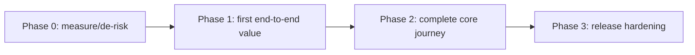

# Vertical-slice roadmap

## Dependency graph

Remove Phase 0 when no baseline/spike is needed. Replace the graph with real dependencies.

## Phases

| Phase | Demonstrable user/system outcome | PRD IDs | Depends on | Mandatory gates | Rollback | Status |
|---|---|---|---|---|---|---|
| P0 |  |  |  |  |  | DRAFT |

For an autonomous frozen contract, this table records kickoff status only. After the baseline commit, track live phase status in `.loop/run-state.json` and phase evidence files; do not mutate this roadmap inside the same run.

## Phase sizing checks

- [ ] Each phase produces end-to-end observable value or retires a named risk.
- [ ] Each phase can be implemented/reviewed without relying on uncommitted future work.
- [ ] Dependencies and integration order are explicit.
- [ ] Entry, done, evidence, rollback, and maximum repair attempts are defined in phase cards.
- [ ] Every phase has a non-empty wall-clock or turn ceiling; cost ceilings remain optional.
- [ ] Parallel phases have disjoint ownership and isolated external resources.
- [ ] No phase exists solely to build speculative infrastructure.
