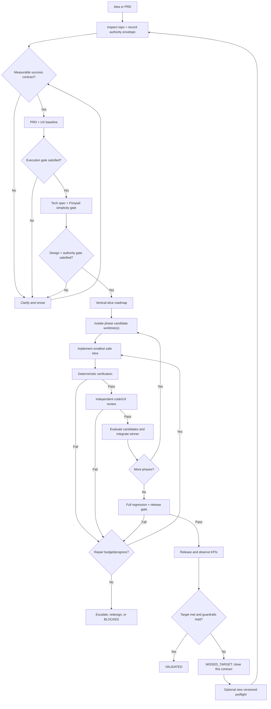

# Product loop protocol

## Contents

1. State machine
2. Intake and artifact gates
3. Delegation and council
4. Phase implementation loop
5. Verification and severity
6. Liveness, escalation, and completion

## 1. State machine

The same protocol covers three nested loops:

- tool loop: model → tool → observed result;
- phase loop: implement → verify → repair;
- delivery loop: approve → phase → integrate → release → observe.

Each outer transition needs evidence. Never turn the delivery loop into an unbounded shell loop.

### Execution modes and kickoff

Use `supervised` unless the user or input PRD explicitly requests `autonomous`. Track run lifecycle independently from artifact status:

`PREFLIGHT ↔ NOT_READY; PREFLIGHT → READY → RUNNING → OBSERVING → VALIDATED | MISSED_TARGET; READY | RUNNING | OBSERVING → BLOCKED`

- `PREFLIGHT`: inspect the repository, research unstable facts, complete the success contract, freeze decision defaults, enumerate credentials/environments, and record authority/budgets/rollback/stop rules.
- `NOT_READY`: implementation never started because a non-inferable KPI, authority grant, credential, irreversible preference, or environment is missing. List the smallest missing inputs; when they arrive, create a new contract version and return to `PREFLIGHT` rather than jumping directly to `READY`.
- `READY`: every required preflight check passes. `product/run-contract.md`, its listed global artifacts, the first phase contract, and an empty first-phase evidence seed are committed together. The evidence seed is part of the candidate base but not the frozen-path set. The full baseline commit and exact frozen paths are recorded only in `.loop/run-state.json`.
- `RUNNING`: kickoff time is recorded after the baseline contract commit is verified. Do not ask routine questions, open a clarify UI, pause for approval, or wait for a human status check. Resolve uncertainty from repository evidence, the frozen contract, existing conventions, reversible defaults permitted by that contract, focused experiments, or an independent council—in that order.
- `OBSERVING`: delivery status is `RELEASED`, but the run is not terminal while the KPI window remains open. Preflight must provide a durable scheduler/monitor for the next observation; store its ID and next check in run state.
- `VALIDATED`, `MISSED_TARGET`, and evidence-backed `BLOCKED` are terminal for this contract. Any later iteration—including work after a blocker is resolved—uses a linked new versioned preflight only after the exact terminal snapshot is archived; a terminal run never silently reopens or resets.

Autonomous mode removes routine mid-run intervention; it does not create authority, credentials, infinite budget, guaranteed provider uptime, or permission to bypass safeguards. Checkpoint every phase, tested SHA, decision, attempt, and external effect so a relaunched parent can resume the earliest non-terminal artifact without reopening frozen choices.

The immutable contract source of truth is the full Git commit containing `product/run-contract.md` and every path listed in that manifest. Lifecycle/timestamps never live in those files; they live only in `.loop/run-state.json`, which stays outside the integration diff. Before resume, external mutation, or release, assert that the commit exists and every frozen path has zero diff from it. Later phase contracts get their own full contract commit before implementation. Never “refresh” a mismatched contract in place.

Write `.loop/run-state.json` atomically and keep, at minimum: `run_id`/`parent_run_id`; global contract version/commit/paths; consumed and maximum wall time/turns/cost/no-progress count; active phase ID/status/contract path/commit and consumed phase budget; phase-keyed candidate worktree/branch/base/head/status, producer child run ID, and requested/attempted/final model records; phase-keyed child run/requested/attempted/final model/cwd/status/artifact records; append-only selection records binding phase, evaluator run, exact candidate SHA set, selected SHA, sanitized-input manifest SHA-256, evidence, and time; external-effect target/result/rollback/evidence records; verified gates; complete checkpoints; integration branch/SHA; observation schedule; next action; and terminal evidence. Gate result is a closed value: empty before a result, then exactly `PASS`, `FAIL`, or `BLOCKED`; prose containing “pass” is never parsed as success. Elapsed time, turns, cost, and a same-class failure count are monotonic during a run. Same-class evidence changes only with an increment; changing or clearing an existing failure class requires recorded progress. Every consumed turn without qualifying progress increments the consecutive-no-progress streak. It may reset only when the integration SHA strictly advances with an exact `PASS` gate or complete checkpoint on that new SHA, or when the active phase becomes fully evidenced `VERIFIED`.

The transition validator, not the JSON Schema alone, is authoritative. It validates the prior snapshot structurally, rejects unknown keys, checks the committed manifest and active phase, enforces candidate common-base/worktree/ref/selection/integration linkage, and then permits the atomic replacement. Candidate and child ledgers enter through `PLANNED` and `QUEUED`/observed `RUNNING`, respectively; external effects, checkpoints, and selections are appended only after each record is complete and are never rewritten.

For any iteration after `VALIDATED`, `MISSED_TARGET`, or `BLOCKED`, first atomically copy the exact terminal state to `.loop/runs/<run_id>.json`. Initialize a fresh template with a distinct `run_id`, `parent_run_id` equal to the archived run, a new contract version, zero new-run consumption, and empty ledgers. The validator rejects the rollover if the archive is missing or differs from the prior state.

### Artifact terminal states

| Artifact | Terminal/resume rule |
|---|---|
| Brief, PRD, UX, tech spec, roadmap | `APPROVED`; stale when an approved upstream version changes |
| Phase and independent review | `VERIFIED` on a recorded immutable SHA |
| Integrated delivery | `RELEASED` on the target-environment release SHA |
| Product outcome | `OBSERVING` until the KPI window, then `VALIDATED` or `MISSED_TARGET` |

Resume at the earliest missing, stale, or non-terminal artifact—not the first artifact whose label is not literally `VERIFIED`.

## 2. Intake and artifact gates

### Gate 0 — authority envelope

Derive authority from the user's request, repository policy, and established workflow; never infer a materially different external action. Record whether the loop may perform local edits/tests, create commits/branches/worktrees, install dependencies or make network reads, push/open/merge PRs, write external data or messages, run migrations, deploy to staging, access secrets, and deploy to production. Include limits, approver/source, and target systems.

Missing authority blocks only the affected mutation. Continue safe read-only analysis and local reversible work when it remains useful. In supervised mode, require explicit human approval immediately before production. In autonomous mode, production requires exact preflight authorization for the named target plus health, rollback, blast-radius, and credential rules; a broad phrase such as “finish the app” is not production authority.

### Gate A — measurable success contract

Do not accept “make it good,” “build a modern app,” or equivalent. Require:

| Field | Required meaning |
|---|---|
| User/problem | Specific beneficiary and observed pain/job |
| Outcome | Behavior or system state that should change |
| Primary measure | Formula or binary observable condition |
| Baseline | Current value, `unknown—measure first`, or `not applicable` with reason |
| Target and window | Threshold and when it will be evaluated |
| Data source/owner | Where evidence comes from and who interprets it |
| Guardrails | Measures that must not regress |
| Acceptance | Frozen `DETERMINISTIC` check or inherently `SUBJECTIVE` named evaluator/rubric allowed by the execution mode |

If the baseline is unknown, make measurement a discovery phase; never fabricate it. For a small technical change, a reproducible binary condition such as “all documented examples execute and the regression test fails before/passes after” is a valid KPI.

### Gate B — approved PRD

The PRD must include stable IDs for requirements and acceptance criteria. Every in-scope requirement maps to at least one acceptance method classified at approval as `DETERMINISTIC` or `SUBJECTIVE`. Subjective rubrics are valid only for inherently subjective judgments and must name the evaluator. In supervised mode that evaluator is the named human approver. In autonomous mode an independent model/council may judge only when the user preauthorized that evaluator and the rubric before kickoff. A must-have deterministic item cannot be waived, converted to subjective, or weakened after failure. In supervised mode, changing its type or criterion requires a versioned PRD change and human reapproval; after autonomous kickoff, it requires ending the current run and starting a newly authorized contract. Explicitly list non-goals, constraints, open questions, instrumentation, risks, and the approval source.

### Gate C — simplest viable technical design

Inspect the current system, then invoke Ponytail in full mode when installed or record its portable decision ladder:

1. Can the requested behavior be removed or handled without code?
2. Does the repository already implement it?
3. Does the language standard library handle it?
4. Does the platform/browser/database/framework provide it natively?
5. Does an installed dependency already handle it?
6. Is a direct, local implementation enough?
7. Only then consider a new dependency, service, abstraction, or subsystem.

Reject speculative extension points, premature shared frameworks, duplicate sources of truth, and infrastructure without a current requirement. Retain safeguards and a rollback path.

Use `ponytail-review` after implementation when available to find removable diff complexity. It explicitly complements rather than replaces correctness, security, performance, accessibility, and acceptance review. Reserve whole-repository simplicity audits for milestones, not every phase.

In supervised mode, record human approval of the versioned technical specification, approved commit, and authority scope before roadmap execution. In autonomous mode, record an independent design-gate result, the frozen decision-policy source, and the full baseline contract commit. A later material change to architecture risk, external services, sensitive data, migration, rollback, authority, or an approved product contract requires supervised reapproval or a new autonomous run contract; it is never silently absorbed mid-run.

### Gate D — UX and mockups

For user-facing work, define the happy path plus loading, empty, error, permission, offline/degraded, and success states. Cover keyboard/focus, screen-reader semantics, touch targets, responsive widths, content/copy, and destructive confirmations. Link or embed mockups with version/approval. User-facing UI, copy, and API design require a model with demonstrated project-specific taste quality and independent review.

### Gate E — vertical-slice roadmap

Each phase must be independently demonstrable, reversible, and traceable to PRD IDs. A phase contract records the pre-contract integration SHA, owned files or boundaries, dependencies, entry criteria, exit checks, risk, retry budget, and evidence location. The resulting phase-contract/evidence-seed commit becomes the common candidate base and is recorded only in mutable state/evidence to avoid a self-referential contract SHA. Freeze the global roadmap plus the first executable phase contract during preflight. Derive each later phase contract only at its boundary from prior evidence, strictly within the frozen roadmap/PRD/authority/global budgets, and commit it before implementation. Prefer end-to-end slices over “all backend, then all frontend.”

### BMAD compatibility

When BMAD is already installed or explicitly required, reuse its four-phase context chain rather than generating parallel documents:

- Analysis → product brief/research;
- Planning → PRD and UX;
- Solutioning → architecture, epics, and stories;
- Implementation → this skill's isolated phase loops, evidence, evaluation, and integration.

Use BMAD Quick Flow for a clear small change and its fuller PRD/architecture/UX track for a complex product. Add measurable KPI, bounded retry, worktree, independent verification, and release-evidence fields where BMAD outputs do not already provide them. Do not install or expand BMAD merely to turn a one-phase task into a ceremony-heavy project.

Primary BMAD workflow map: https://github.com/bmad-code-org/BMAD-METHOD/blob/main/docs/reference/workflow-map.md

## 3. Delegation and council

### Agent task contract

Give every subagent:

- one outcome and explicit out-of-scope boundary;
- read/write scope and worktree path;
- source artifacts and pinned base SHA;
- required checks and evidence format;
- maximum attempts/time and what counts as blocked;
- the inherited authority envelope and whether it may create commits, branches, PRs, network writes, or external effects.

Do not delegate an unbounded goal or silently broaden authority. Research/review agents should be read-only unless an edit is explicitly requested.

### Parallelism rule

Parallelize only when tasks are dependency-independent or candidates intentionally compete. Use disjoint ownership where possible. One integrator serializes merges. If work shares a database, port, cache, external sandbox, or credential, namespace those resources too; filesystem isolation alone is insufficient.

### LLM council

Use a council only when at least one condition holds:

- a high-impact PRD, architecture, privacy, security, or UX decision has plausible alternatives;
- two materially different implementation approaches have failed;
- independent reviewers disagree on a release-blocking issue; or
- a choice is hard to test cheaply and costly to reverse.

Protocol:

1. Give two or three members the same evidence and decision question independently; do not show them each other's answers.
2. Assign lenses such as product/UX, technical/simplicity, and risk/verification.
3. Require assumptions, recommendation, failure modes, falsifying test, and confidence—not votes alone.
4. Give a separate adjudicator anonymized proposals and the rubric.
5. If disagreement is empirical, run the smallest worktree spike that resolves it. If it is a product preference, policy, or irreversible tradeoff, supervised mode asks the human approver; autonomous mode applies the frozen decision policy or terminates `BLOCKED` when none covers the choice.

Do not run councils for routine edits. Consensus without evidence is not a gate.

## 4. Phase implementation loop

Use this sequence for one ready phase:

`SELECT → ISOLATE → TEST → IMPLEMENT → VERIFY → REVIEW → REPAIR | EVALUATE → INTEGRATE → RECORD`

1. **Select:** Confirm dependencies, inherited authority, entry criteria, at least one non-empty wall-clock/turn ceiling, and a consecutive-no-progress threshold; create an immutable phase contract plus an empty mutable evidence seed, commit both to the clean integration branch, and use that exact commit as every active-phase candidate's common base.
2. **Isolate:** Create candidate worktree(s) from the same base SHA.
3. **Test:** Add or identify an acceptance check that demonstrates the missing behavior when feasible. Protect approved tests from being weakened.
4. **Implement:** Make the smallest phase-scoped safe diff. Record dependency or architecture changes.
5. **Verify:** Run cheap checks first and capture exact command/rubric, tested SHA, environment, executor, reviewer independence, timestamp, exit status/actual result, and artifact path.
6. **Review:** Use a fresh reviewer. Inspect product traceability, correctness, test changes, security/privacy, maintainability, and user-facing quality.
7. **Repair:** Convert each valid finding to a bounded task. Rerun all checks affected by a repair.
8. **Evaluate:** Reject candidates with any mandatory gate failure; compare only survivors.
9. **Integrate:** Merge/cherry-pick through the integration worktree and rerun targeted plus full relevant checks.
10. **Record:** Update phase status, decision log, evidence, model eval result, attempts, elapsed time, actual/estimated cost, and PR.

## 5. Verification and severity

### Verification cascade

Stop at the first failed mandatory level:

1. scope/diff sanity, generated-file checks, and protected-test inspection;
2. format, lint, static analysis, typecheck, and targeted unit tests;
3. integration/contract/data-migration tests and relevant security scans;
4. build/package/install and full affected regression suite;
5. API or UI behavioral E2E in a representative environment;
6. computer-use visual QA across required viewports, accessibility checks, and copy/state review;
7. fresh independent semantic review and PR policy checks.

Deterministic failures outrank model opinions. A reviewer may add a missing test, but cannot waive or replace a failed must-have deterministic criterion. Changing an approved criterion/type requires a versioned PRD update and supervised reapproval or a new autonomous run contract; the current autonomous run cannot weaken it to resume.

### Finding severity

| Severity | Meaning | Merge rule |
|---|---|---|
| P0 | Active data loss, security incident, or unusable critical path | Stop immediately |
| P1 | Must-have deterministic acceptance failure, exploitable risk, major regression, or no safe rollback | Must fix before merge/release; non-exceptable without changing and reapproving the PRD |
| P2 | Real bounded defect, accessibility issue, or maintainability risk | Fix before release or record owner/date and explicit acceptance |
| P3 | Polish or optional improvement | May defer with rationale |

Every finding needs evidence, impacted requirement, reproduction, and a concrete pass condition. Avoid stylistic churn with no product or maintenance impact.

## 6. Liveness, escalation, and completion

### Default repair policy

- Attempt 1: diagnose the root cause and make a targeted repair with the current worker.
- Attempt 2: change the approach or switch to a stronger/different model family; include the exact failure evidence.
- Attempt 3: reconsider the spec/design with a council or focused spike.
- After three failures of the same class, stop repeating that approach. Escalate model/technique, run a bounded council or spike, or redesign inside the frozen contract. Set `BLOCKED` only when these alternatives are exhausted, the global phase ceiling is reached, or progress requires authority/credentials/a contract change the run does not have.

Every approved phase must have a wall-clock or turn limit and a consecutive-no-progress threshold. In autonomous mode reaching a phase limit triggers checkpoint, escalation, and either a permitted redesign or evidence-backed terminal `BLOCKED`; it does not trigger a routine human pause. Reaching any global run wall-time, turn, cost, or no-progress ceiling transitions directly to `BLOCKED`; redesign and model escalation cannot reset it. A cost ceiling is optional; when none is supplied, record cost without lowering the quality bar. Never retry the same prompt and conditions unchanged, and never implement “never stop” as an infinite retry loop.

For transient provider, network, CI, or environment failures, use bounded exponential backoff, switch an eligible provider/model when allowed, and resume from the last durable checkpoint. Persist the current phase, child run/session IDs, worktree/branch/SHA, last verified gate, failure signature, attempt count, and next action before any parent process exits.

### Anti-reward-hacking rules

- Do not trust a completion phrase without orchestrator-run evidence.
- Do not delete, skip, loosen, or rewrite an approved test solely to pass it.
- Do not replace real integrations with mocks outside the approved test boundary.
- Do not hide warnings/errors, swallow exceptions, or mark checks “not applicable” without evidence.
- Inspect test and snapshot diffs as carefully as production code.

### Completion decision

Use the release evidence template. Grant `RELEASED` only on the integrated release SHA and target environment. Keep product outcome `OBSERVING` until the KPI window closes. Set it to `VALIDATED` only when the primary target and guardrails pass; otherwise set `MISSED_TARGET`. Archive any terminal run before an already-authorized follow-on preflight, including a continuation after a resolved `BLOCKED` condition. Report these states honestly rather than claiming impact at deploy time.

## Research basis

- Ralph loop: https://ghuntley.com/ralph/ and https://github.com/anthropics/claude-code/blob/main/plugins/ralph-wiggum/README.md
- Spec-driven workflow: https://github.github.com/spec-kit/
- Agent/evaluator patterns: https://www.anthropic.com/engineering/building-effective-agents and https://openai.github.io/openai-agents-python/multi_agent/
- Git worktrees: https://git-scm.com/docs/git-worktree.html
